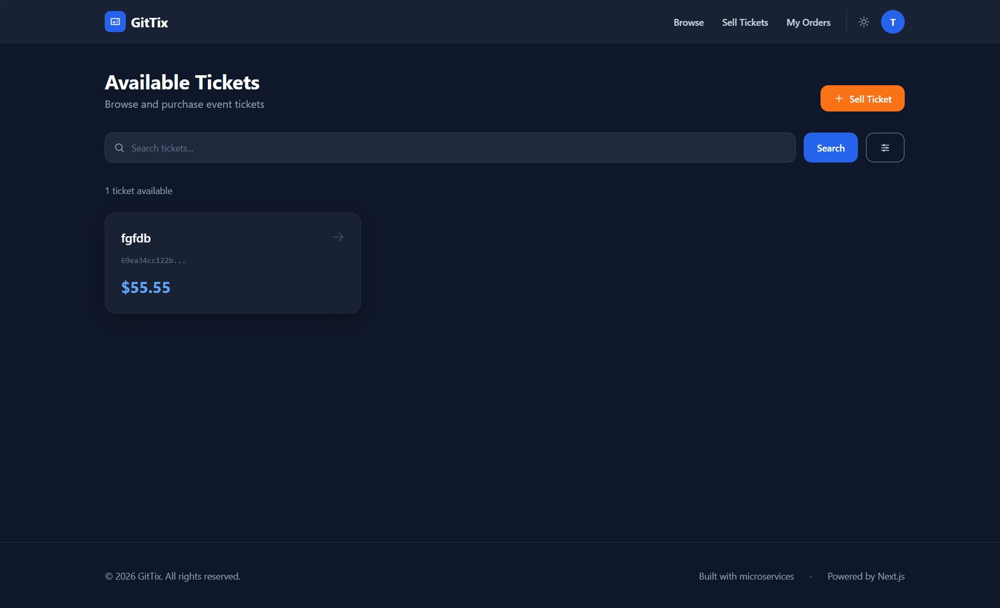
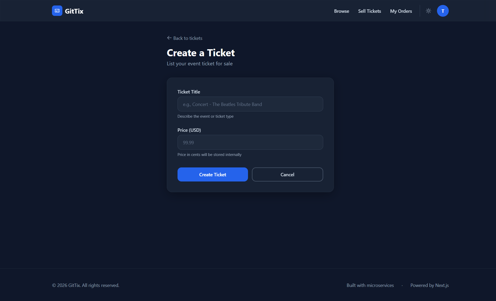
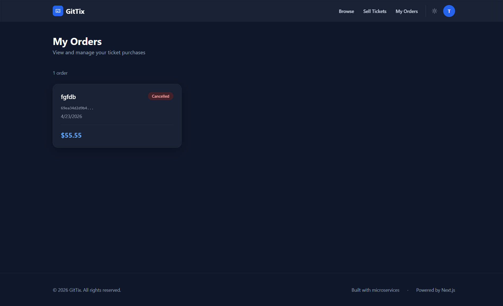
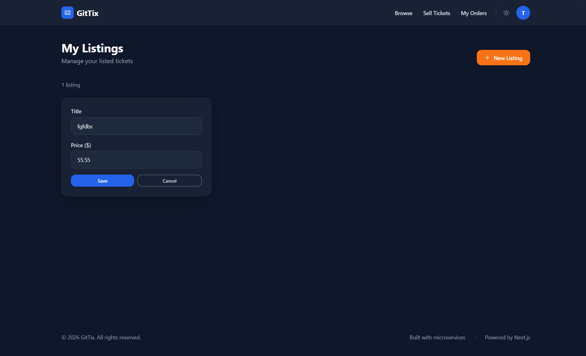

# GitTix — Event Ticket Marketplace

A production-grade microservices ticketing platform where users buy and sell event tickets with secure Stripe payments, 15-minute order expiration, and real-time event-driven architecture.

[](https://nodejs.org/)
[](https://nextjs.org/)
[](https://www.typescriptlang.org/)
[](https://www.docker.com/)
[](https://kubernetes.io/)
[](https://nats.io/)
[](https://stripe.com/)

## Screenshots

### Landing Page
Search-focused marketplace hero with popular categories and featured listings.


### Browse Tickets
Search, filter by price, and sort available tickets.



### Create a Ticket
List your event ticket for sale with title and price.



### My Orders
Track order status with real-time updates and cancellation badges.



### My Listings
Manage your tickets with inline editing and deletion.



## Architecture

```
Browser --> Ingress Nginx (ticketing.dev)
  |-- /api/users/*    --> auth-srv       (Express, MongoDB)
  |-- /api/tickets/*  --> tickets-srv    (Express, MongoDB, NATS)
  |-- /api/orders/*   --> orders-srv     (Express, MongoDB, NATS)
  |-- /api/payments/* --> payments-srv   (Express, MongoDB, NATS, Stripe)
  |-- /*              --> client-v2-srv  (Next.js 15)

NATS Streaming --> event bus connecting all backend services
expiration-srv --> Bull queue + Redis, 15-min order expiration
```

## Services

| Service | Stack | Purpose |
|---------|-------|---------|
| **auth** | Express, MongoDB | User signup/signin/signout, JWT in cookie |
| **tickets** | Express, MongoDB, NATS | Ticket CRUD, publishes TicketCreated/Updated |
| **orders** | Express, MongoDB, NATS | Order lifecycle, 15-min expiration window |
| **payments** | Express, MongoDB, NATS, Stripe | Stripe charges, publishes PaymentCreated |
| **expiration** | Bull, Redis, NATS | Delayed jobs for order auto-expiration |
| **client-v2** | Next.js 15, Tailwind CSS | SSR-first App Router frontend |

## Key Features

- **Microservices architecture** with database-per-service isolation
- **Event-driven sync** via NATS Streaming with optimistic concurrency (version-based)
- **SSR-first frontend** using Next.js 15 Server Components and Server Actions
- **Glassmorphism design system** with Space Grotesk + DM Sans typography
- **Cookie-based auth** with JWT, forwarded across services via SSR
- **Framer Motion** page transitions and scroll animations
- **Search & filters** with URL-driven state (query, price range, sort)
- **Toast notifications** for user feedback across all actions
- **15-minute order expiration** with real-time countdown timer
- **Stripe integration** for secure payments

## Tech Stack

**Frontend:** Next.js 15, React 19, TypeScript, Tailwind CSS, Framer Motion

**Backend:** Node.js 18, Express, TypeScript, Mongoose, NATS Streaming, Bull, Stripe

**Infrastructure:** Docker, Kubernetes, Skaffold, Ingress Nginx, Redis

**Shared:** `@wizlitickets/common` npm package (errors, middlewares, events, types)

## Getting Started

### Prerequisites

- [Docker Desktop](https://www.docker.com/products/docker-desktop/) with Kubernetes enabled
- [Skaffold](https://skaffold.dev/docs/install/)
- [ingress-nginx](https://kubernetes.github.io/ingress-nginx/deploy/) controller installed

### Setup

1. **Add host entry**
   ```
   # Add to /etc/hosts (Linux/Mac) or C:\Windows\System32\drivers\etc\hosts (Windows)
   127.0.0.1 ticketing.dev
   ```

2. **Create Kubernetes secrets**
   ```bash
   kubectl create secret generic jwt-secret --from-literal=JWT_KEY=your-jwt-secret
   kubectl create secret generic stripe-secret --from-literal=STRIPE_KEY=your-stripe-secret-key
   ```

3. **Start the cluster**
   ```bash
   skaffold dev
   ```

4. **Open** [https://ticketing.dev](https://ticketing.dev)

### Manual Deploy (without Skaffold)

```bash
# Build all images
docker build -t abdessalamwizli/auth:latest ./auth
docker build -t abdessalamwizli/tickets:latest ./tickets
docker build -t abdessalamwizli/orders:latest ./orders
docker build -t abdessalamwizli/payments:latest ./payments
docker build -t abdessalamwizli/expiration:latest ./expiration
docker build -t abdessalamwizli/client-v2:latest ./client-v2

# Apply manifests
kubectl apply -f infra/k8s/
```

## Project Structure

```
ticketing_system/
|-- auth/              # Auth service
|-- tickets/           # Tickets service
|-- orders/            # Orders service
|-- payments/          # Payments service
|-- expiration/        # Expiration service (Bull + Redis)
|-- client-v2/         # Next.js 15 frontend
|-- common/            # @wizlitickets/common package source
|-- infra/
|   |-- k8s/           # Kubernetes manifests
|-- images/            # Screenshots
|-- skaffold.yaml
```

## Testing

```bash
# Run tests for a specific service
cd tickets && npm test

# Type-check a service
cd tickets && npx tsc --noEmit
```

## License

ISC
